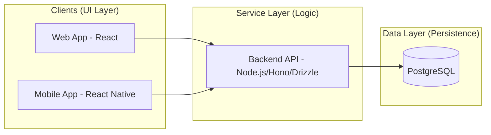

# Hop On: Decoupled Service Architecture

This document defines a multi-service architecture designed for maximum flexibility, scalability, and mobile-readiness.

## 1. System Topology
The system is divided into three distinct layers. Each layer is "black-boxed" and communicates via standard protocols.



---

## 2. The Services

### 2.1 Data Layer (PostgreSQL)
- **Role:** Pure storage and relational integrity.
- **Access:** Only accessible by the Service Layer (via Drizzle ORM).
- **Environment:** Dockerized for local development; managed RDS/Supabase for cloud.

### 2.2 Service Layer (The "Brain")
- **Role:** Handles the "Pure Temporal" business logic, Authentication (Google/Apple), and Permissions.
- **Key Responsibilities:**
    - **Auth Gateway:** Validates Social Login tokens.
    - **Logic Engine:** Performs date shifting, gap detection, and chronological sorting.
    - **Permission Guard:** Checks the `Permissions` table before allowing any CRUD operation.
- **Protocol:** RESTful JSON API.

### 2.3 UI Layer (The "Face")
- **Role:** Rendering the high-density itinerary and interactive map.
- **State Management:** Syncs with the API. Does not contain any database-specific logic.

---

## 3. Data Model (SQL-First)

### 3.1 Schema Definition (Drizzle)
```typescript
// Users: Global identity
interface User {
  id: string; // Auth Provider UID
  email: string;
  provider: 'google' | 'apple';
}

// Trips: The container
interface Trip {
  id: string;
  ownerId: string;
  name: string;
  visibility: 'private' | 'public';
}

// Permissions: The many-to-many join table
interface Permission {
  tripId: string;
  userId: string;
  role: 'editor' | 'viewer';
}

// Events: The flat timeline
interface ItineraryEvent {
  id: string;
  tripId: string;
  type: 'STAY' | 'ACTIVITY' | 'TRAVEL' | 'CHECK_IN' | 'CHECK_OUT';
  startTime: Date;
  endTime?: Date;
  title: string;
  locationName?: string;
  coords?: [number, number];
  isLocked: boolean;
}
```

---

## 4. Development Environment (Docker)
We use `docker-compose` to orchestrate the services locally.

- **`hopon-db`:** Postgres 16 image.
- **`hopon-api`:** Node.js environment running the backend service.
- **`hopon-web`:** Vite/React environment for the frontend.

## 5. Mobile Readiness Strategy
Because the logic (Gaps, Shifting, Permissions) is encapsulated in the **Service Layer**, creating a mobile app simply requires:
1. Building the mobile UI in React Native.
2. Connecting to the same `hopon-api` endpoints.
3. Authenticating with the same Social Auth flow.
